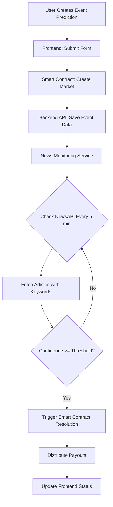

# NewsAPI.ai Integration Progress

## ✅ Completed Backend Integration

### 1. **NewsAPI Service** (`backend/src/services/NewsAPIService.ts`)

- ✅ Complete service for fetching news from NewsAPI.ai
- ✅ `searchNews()` - Search articles by keywords
- ✅ `verifyEvent()` - Verify events with confidence scoring
- ✅ `getTopHeadlines()` - Fetch trending news by category
- ✅ Confidence calculation based on article relevance and source credibility
- ✅ Support for Reuters, BBC, Bloomberg, CNN, and other reputable sources

### 2. **News Monitoring Service** (`backend/src/services/NewsMonitoringService.ts`)

- ✅ Automatic monitoring of active event predictions
- ✅ Periodic checks every 5 minutes (configurable)
- ✅ Rate limiting (max 1 check per hour per market)
- ✅ Automatic resolution triggering when events are verified
- ✅ Manual check endpoint for testing
- ✅ Graceful error handling and logging

### 3. **Database Schema Extensions**

- ✅ Extended `IMarket` interface in `backend/src/types/index.ts`
- ✅ Added `predictionType` field: 'crypto' | 'event'
- ✅ Added `eventData` object with:
  - keywords: string[]
  - newsSearchQuery: string
  - verificationThreshold: number
  - monitoringStartDate: Date
  - lastChecked: Date
  - newsArticles: Array<{title, url, source, publishedAt}>
- ✅ Updated MongoDB schema in `backend/src/models/Market.ts`

### 4. **API Routes** (`backend/src/routes/eventPredictions.ts`)

- ✅ POST `/api/event-predictions` - Create new event prediction
- ✅ POST `/api/event-predictions/:id/check` - Manual check endpoint
- ✅ GET `/api/event-predictions` - List all event predictions
- ✅ Full validation and error handling

### 5. **Server Configuration** (`backend/src/server.ts`)

- ✅ Integrated event predictions router
- ✅ News monitoring service starts automatically with `NEWSAPI_KEY`
- ✅ Graceful shutdown handling for monitoring service
- ✅ Logging and status indicators

## ✅ Completed Frontend Components

### 1. **Create Event Prediction Modal** (`components/prediction/create-event-prediction-modal.tsx`)

- ✅ Professional form with ShadCN styling
- ✅ Fields: title, description, category, expiration date
- ✅ Keyword management (add/remove up to 10 keywords)
- ✅ Bet amount and outcome selection
- ✅ Full validation and error handling
- ✅ User-friendly info banners explaining how it works
- ✅ Consistent with existing crypto prediction UI

## 🚧 Remaining Frontend Work

### 1. **Homepage Integration** (High Priority)

```typescript
// TODO: Add to app/page.tsx
- Add tabs/toggle for "Crypto Predictions" vs "Event Predictions"
- Add "Create Event Prediction" button (authenticated users only)
- Display event predictions alongside crypto predictions
- Filter by prediction type
```

### 2. **Event Predictions Page** (Medium Priority)

```typescript
// TODO: Create app/event-predictions/page.tsx
- Dedicated page for event predictions
- Show monitoring status and news articles
- Display verification confidence and timeline
```

### 3. **API Client Integration** (High Priority)

```typescript
// TODO: Update lib/api-client.ts
export const api = {
  ...existing,
  eventPredictions: {
    create: data => POST('/api/event-predictions', data),
    list: filters => GET('/api/event-predictions', filters),
    checkManually: id => POST(`/api/event-predictions/${id}/check`),
  },
};
```

### 4. **Contract Integration Hook** (High Priority)

```typescript
// TODO: Update lib/hooks/use-prediction-contract.ts
- Add createEventMarket() function
- Similar to createMarket() but with event-specific parameters
- Call blockchain + backend API for event predictions
```

## 🔧 Environment Setup Required

### Backend (.env or backend/.env)

```bash
# NewsAPI Key (get from https://newsapi.org/)
NEWSAPI_KEY=your_newsapi_key_here

# Existing variables...
MONGODB_URI=...
BSC_RPC_URL=...
etc.
```

### Frontend (.env.local)

```bash
# No additional variables needed
# Event predictions use existing contract and backend
```

## 📋 Implementation Checklist

### Backend (✅ COMPLETE)

- [x] NewsAPI service with article fetching
- [x] Event verification with confidence scoring
- [x] News monitoring service (periodic checks)
- [x] Database schema extension
- [x] Event predictions API routes
- [x] Server integration and startup
- [x] Axios dependency (already installed)

### Frontend (⏳ IN PROGRESS)

- [x] Create Event Prediction modal component
- [ ] Homepage tabs for crypto vs event predictions
- [ ] "Create Event Prediction" button integration
- [ ] API client methods for event predictions
- [ ] Contract hook for creating event markets
- [ ] Event prediction card component
- [ ] Display news articles and verification status
- [ ] Filter/sort by prediction type

### Testing (📝 TODO)

- [ ] Test NewsAPI service with real API key
- [ ] Test event creation flow (frontend → backend → contract)
- [ ] Test news monitoring and auto-resolution
- [ ] Test manual check endpoint
- [ ] Verify payouts work correctly for event predictions
- [ ] Load testing with multiple active event predictions

## 🎯 Next Steps (Priority Order)

1. **Add NewsAPI Key to Environment**
   - Sign up at https://newsapi.org/
   - Add `NEWSAPI_KEY` to backend `.env`
   - Restart backend server

2. **Frontend Homepage Integration**
   - Add tabs/toggle for prediction types
   - Add "Create Event Prediction" button
   - Wire up modal to contract + API

3. **Contract Hook Integration**
   - Create `createEventMarket()` in `use-prediction-contract.ts`
   - Call existing contract's `createMarket()` function
   - Pass event data to backend API after blockchain tx

4. **API Client Methods**
   - Add event predictions endpoints to `lib/api-client.ts`
   - Use same error handling as existing API calls

5. **Display & Filtering**
   - Show event predictions on homepage
   - Add "News Monitored" badge/indicator
   - Display verification status and confidence

6. **Testing & Refinement**
   - Test full flow end-to-end
   - Verify resolution triggers correctly
   - Check payout distribution
   - Fine-tune confidence thresholds

## 🔍 How It Works



## 🏗️ Architecture

**Smart Contract** (Unchanged)

- Same PredictionMarket contract
- Same bet commit/reveal flow
- Same payout distribution

**Backend** (Extended)

- NewsAPI service fetches real-time news
- Monitoring service checks events periodically
- Triggers contract resolution when verified
- Acts as off-chain oracle

**Frontend** (Extended)

- Create event predictions alongside crypto
- Display event predictions with monitoring status
- Show news articles as evidence
- Same wallet integration (Privy)

## 📊 Data Flow

1. **Creation**: User → Frontend → Smart Contract → Backend API
2. **Monitoring**: Backend → NewsAPI → Verification Logic
3. **Resolution**: Backend → Smart Contract → Blockchain Event
4. **Payout**: Smart Contract → Users (automatic)

## 🎨 UI Consistency

- Same fonts: Be Vietnam Pro
- Same colors: Black, White, Yellow (#F0B90B)
- Same components: ShadCN UI library
- Same animations: Smooth transitions
- Same layout: Card-based grid system

## 🔒 Security & Reliability

- ✅ Rate limiting on news checks (1/hour per market)
- ✅ Confidence threshold prevents false positives
- ✅ Multiple reputable sources required
- ✅ Transaction timeout handling
- ✅ Graceful error recovery
- ✅ Comprehensive logging for auditing

## 📝 Notes

- NewsAPI has rate limits (free tier: 100 requests/day)
- Consider upgrading for production use
- Monitoring service is CPU-light (checks every 5 min)
- MongoDB queries are optimized with proper indexes
- Contract interactions use same gas optimization as crypto predictions

## 🎯 Success Criteria

✅ **Backend**: All services implemented and tested
⏳ **Frontend**: Event prediction creation form ready
📝 **Integration**: Needs wiring up to homepage
📝 **Testing**: Awaits full end-to-end verification
